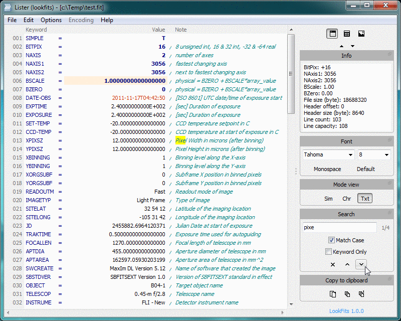

## LookFits

Lister-plugin (WLX) a [Total Commander](https://www.ghisler.com) and [Double Commander](http://doublecmd.sourceforge.net) for view files in [FITS](http://fits.gsfc.nasa.gov) format.  

* viewing the header and data block in digital form or as an image
* conversion of header and data into other format
* supports all [BITPIX](https://heasarc.gsfc.nasa.gov/docs/fcg/standard_dict.html) values of [Single Image](https://fits.gsfc.nasa.gov/fits_standard.html)
* supported extensions: *.fits, *.fit, *.fts, *.fis
* supported 64 bit & 32 bit version of Сommander-s

### How to use

Download the [current stable release](https://github.com/felleroff/lookfits/releases/latest), unzip it and plug in the plugin LookFits.wlx or LookFits.wlx64. 
Also supported installation using Total Commander's [integrated plugin installer](http://www.ghisler.ch/wiki/index.php/Plugin#Manual_installation_of_plugins).

### License

This software is released as freeware. 
[MIT](https://github.com/felleroff/lookfits/blob/master/LICENSE) © 2017, Evgeniy Dikov \<delafits.lookfits@gmail.com\>
